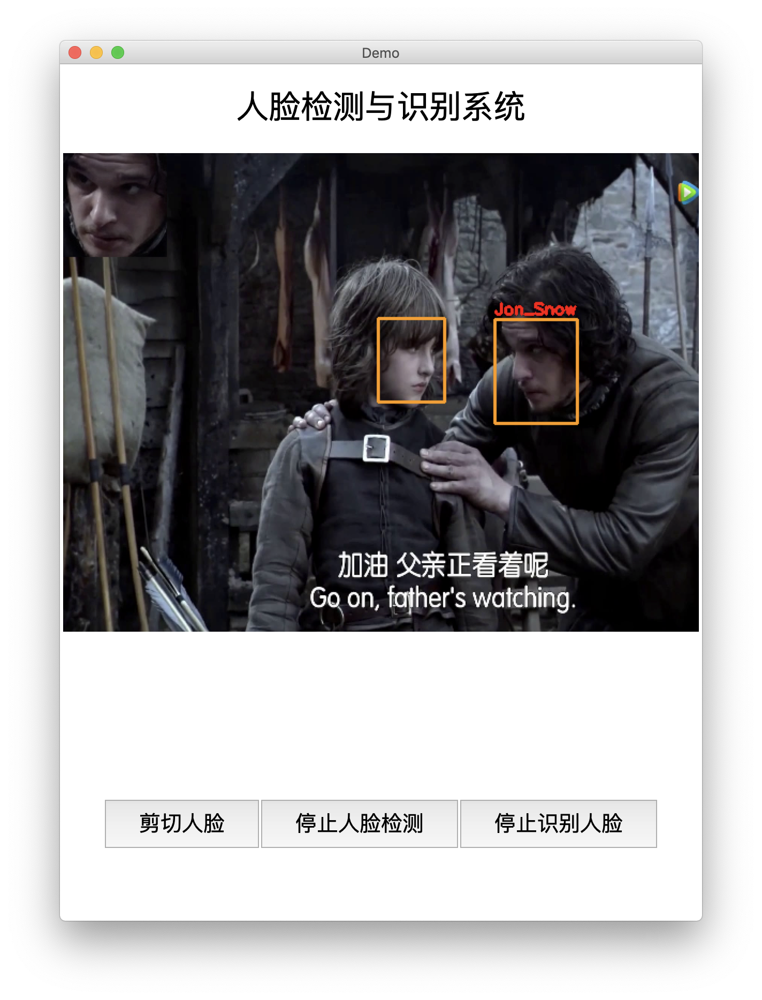
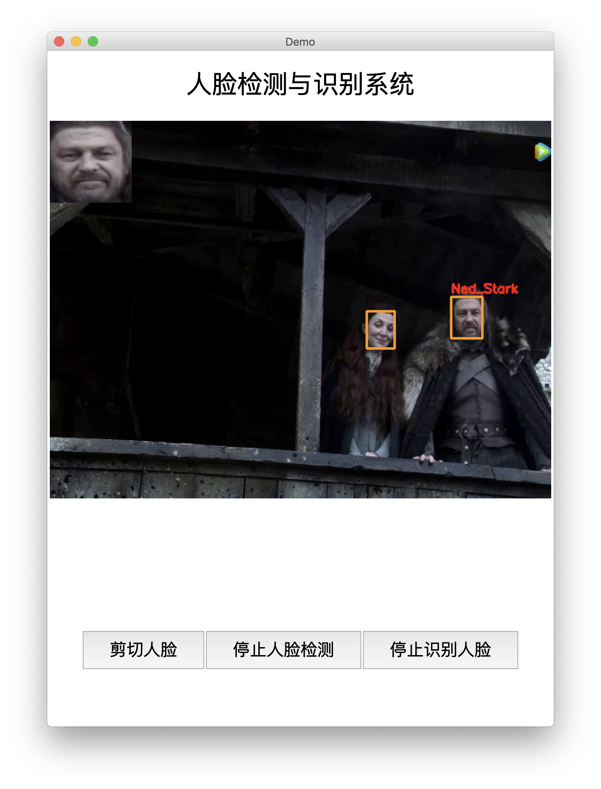
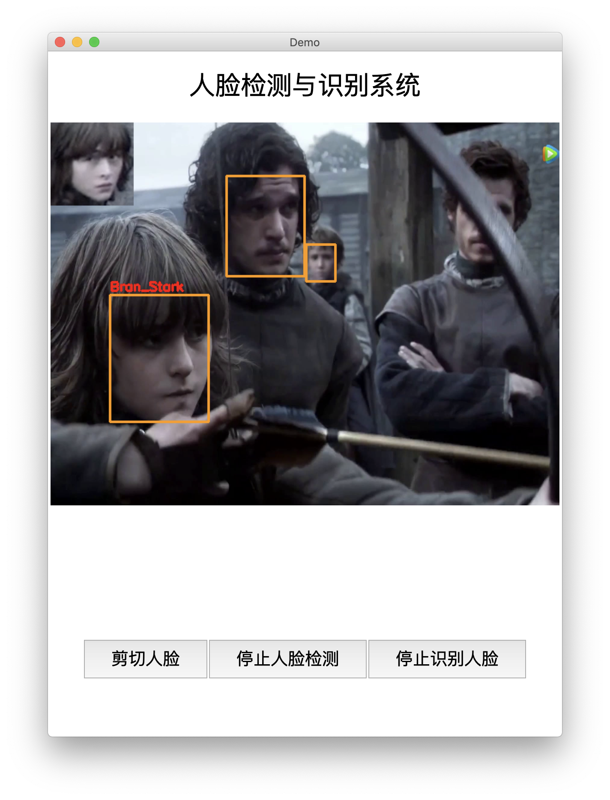
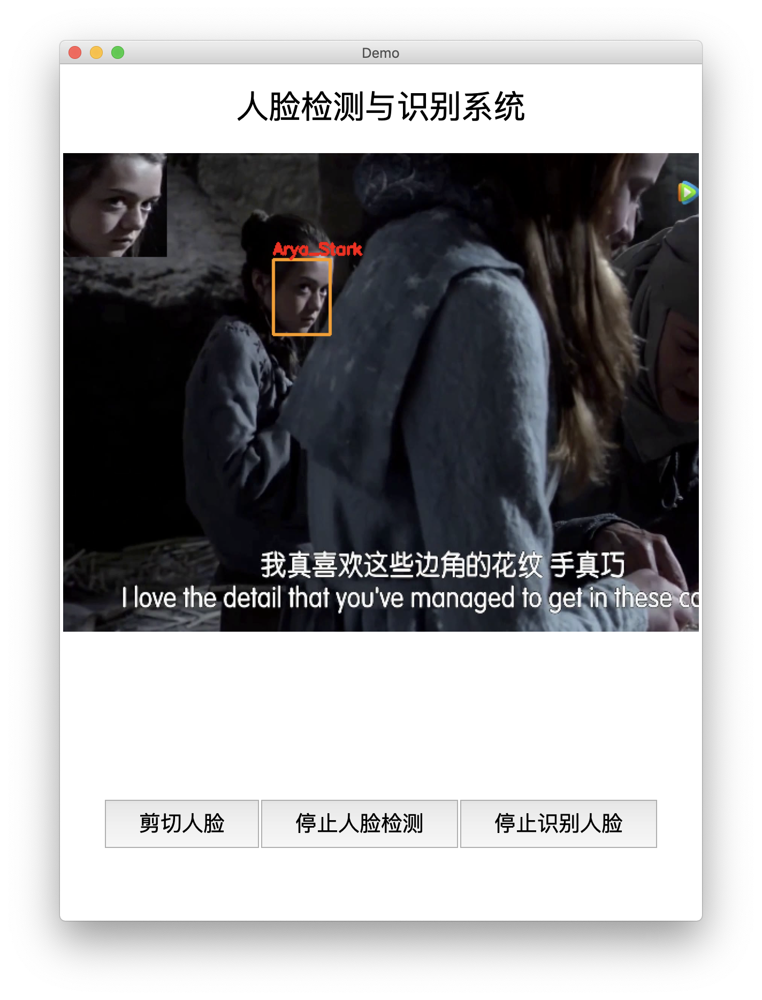

# FaceNet and MTCNN based Face Recognition System

[TOC]

## Intruduction of the file structure

+  `main`      you should run the demo here.

+ `Detection & train_models & data` The file about MTCNN, you dont need to focus on both of the two files.

+ `facenet`  The Facenet model file.

+ `face_data`  The picrures of face you should save in this file.

  

## How to use this system?

### If you want to add your own face_data

Just put the picture into the file `face_data`  in **jpg** format. And then come to the directory `main`  and run `python update_face_data.py`.

### If you want to test the camera

`cd main` & `python camera_test.py`

### If you wang to test the video

`cd main` & `python tkinter_demo.py [video_path]`

## Show the demo

*The system will only check the biggest face on the frame*

 